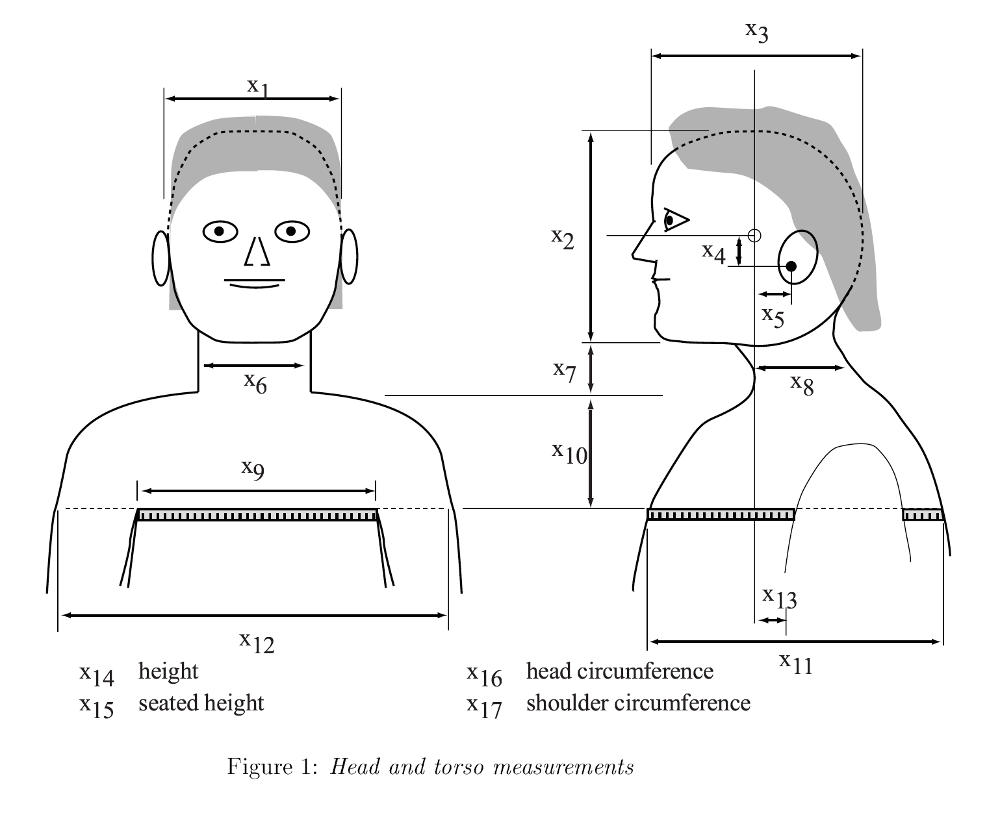
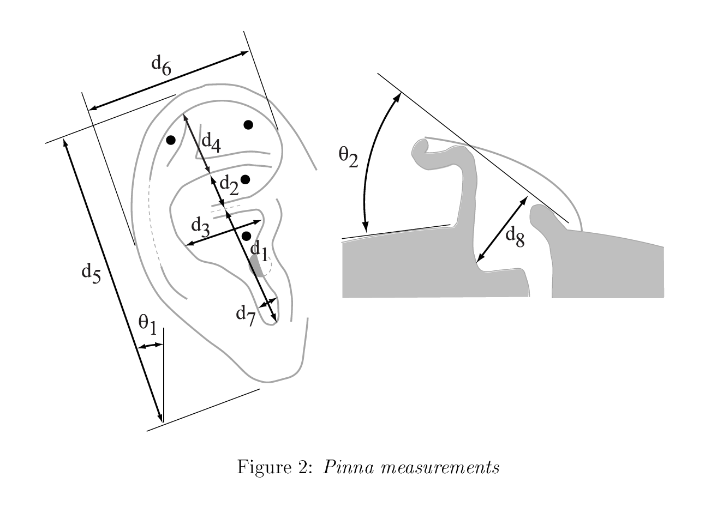

# HRTF Machine Learning Project

Generate an HRTF based on the input of direction of source, ear size, and headsize
--

## HDF5 Format

Datasets are stored in the hdf5 format with the following structure
	
	subject
		hrir_l, hrir_r, srcpos
		attrs
			fs
			(depends on dataset)

Additionaly spherical coordinates are represented in the folloing manner 

```math
(azimuth\ \theta, elevation\ \phi, r)
```
with the following conversions
```math
x = r\cos(\theta)\cos(\phi)
```
```math
y = r\sin(\theta)\cos(\phi)
```
```math
z = r\sin(\phi)
```
(0, 90) is directory above. (0, 0) is directly in front. (90, 0) is directory left. (90,0) is directly right.


## Cipic Docs

| Var	        |		Meaning				|
|---------------|---------------------------|
|$`x_{1}`$		| head width				|
|$`x_{2}`$		| head height				|
|$`x_{3}`$		| head depth				|
|$`x_{4}`$		| pinna offset down			|
|$`x_{5}`$		| pinna offset back			|
|$`x_{6}`$		| neck width				|
|$`x_{7}`$		| neck height				|
|$`x_{8}`$		| neck depth				|
|$`x_{9}`$		| torso top width			|
|$`x_{10}`$		| torso top height			|
|$`x_{11}`$		| torso top depth			|
|$`x_{12}`$		| shoulder width			|
|$`x_{13}`$		| head offset forward			|
|$`x_{14}`$		| height					|
|$`x_{15}`$		| seated height				|
|$`x_{16}`$		| head circumference		|
|$`x_{17}`$		| shoulder circumference	|
|$`d_{1}`$		| cavum concha height		|
|$`d_{2}`$		| cymba concha height		|
|$`d_{3}`$		| cavum concha width		|
|$`d_{4}`$		| fossa height				|
|$`d_{5}`$		| pinna height				|
|$`d_{6}`$		| pinna width				|
|$`d_{7}`$		| intertragal incisure width|
|$`d_{8}`$		| cavum concha depth		|
|$`\theta_{1}`$	| pinna rotation angle		|
|$`\theta_{2}`$	| pinna flare angle			|






## Python Packages
* h5py
* numpy
* scipy
