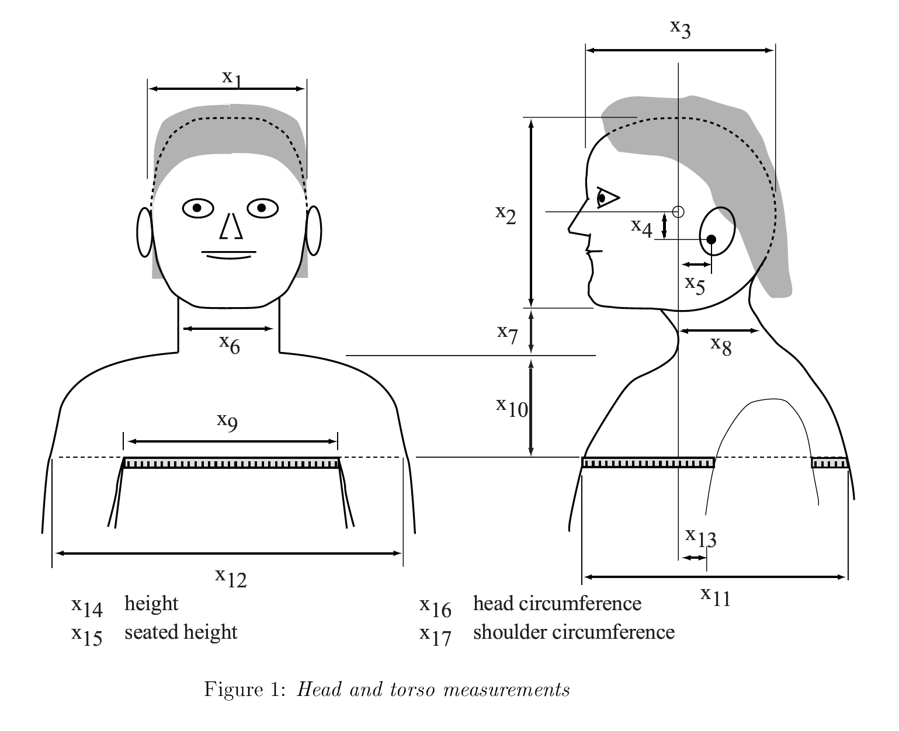
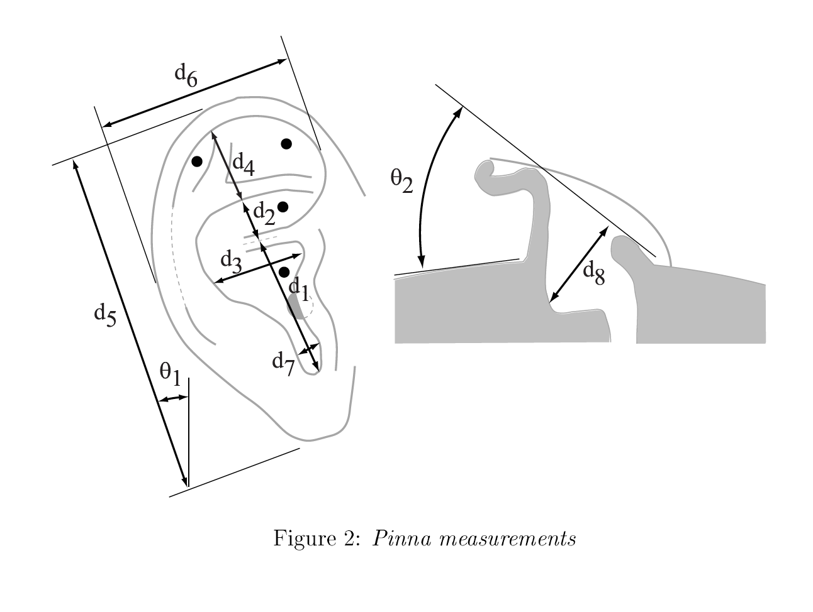

# HRTF Machine Learning Project

Generate an HRTF based on the input of direction of source, ear size, and headsize


## HDF5 Format

Datasets are stored in the hdf5 format with the following structure
	
	subject
		hrir_l, hrir_r, srcpos
		attrs
			fs
			(depends on dataset)

Additionaly spherical coordinates are represented in the folloing manner 

```math
(azimuth\ \theta, elevation\ \phi, r)
```
with the following conversions
```math
x = r\cos(\theta)\cos(\phi)
```
```math
y = r\sin(\theta)\cos(\phi)
```
```math
z = r\sin(\phi)
```
(0, 90) is directory above. (0, 0) is directly in front. (90, 0) is directory left. (90,0) is directly right.


## Cipic Docs

| Var	        |		Meaning				|
|---------------|---------------------------|
|$`x_{1}`$		| head width				|
|$`x_{2}`$		| head height				|
|$`x_{3}`$		| head depth				|
|$`x_{4}`$		| pinna offset down			|
|$`x_{5}`$		| pinna offset back			|
|$`x_{6}`$		| neck width				|
|$`x_{7}`$		| neck height				|
|$`x_{8}`$		| neck depth				|
|$`x_{9}`$		| torso top width			|
|$`x_{10}`$		| torso top height			|
|$`x_{11}`$		| torso top depth			|
|$`x_{12}`$		| shoulder width			|
|$`x_{13}`$		| head offset forward			|
|$`x_{14}`$		| height					|
|$`x_{15}`$		| seated height				|
|$`x_{16}`$		| head circumference		|
|$`x_{17}`$		| shoulder circumference	|
|$`d_{1}`$		| cavum concha height		|
|$`d_{2}`$		| cymba concha height		|
|$`d_{3}`$		| cavum concha width		|
|$`d_{4}`$		| fossa height				|
|$`d_{5}`$		| pinna height				|
|$`d_{6}`$		| pinna width				|
|$`d_{7}`$		| intertragal incisure width|
|$`d_{8}`$		| cavum concha depth		|
|$`\theta_{1}`$	| pinna rotation angle		|
|$`\theta_{2}`$	| pinna flare angle			|






## Setup

```bash
conda create -n hrtf python=3.9.16
conda activate hrtf
pip install -r requirements.txt
```

## Branch Map

### Running training and prediction

All commands run from `src/networks/`. Train:

```bash
cd src/networks
python main_network.py cipic all -a train --tag <tag>
```

Predict (loads saved weights, enters interactive mode):

```bash
cd src/networks
python main_network.py cipic all -a predict --tag <tag>
```

At the interactive prompt:
```
lsd 0    # LSD for CIPIC subject 003 (training) — read the "Left/Right magtotal [full, <11k]" line
lsd 2    # LSD for CIPIC subject 009 (test)      — read the "Left/Right magtotal [full, <11k]" line
```

> **Note:** `lsd N` index is not the CIPIC subject ID. CIPIC skips many IDs (000–002, 004–007, … don't exist), so the dataset stacks only valid subjects in order. Index 0 = subject 003, index 2 = subject 009.

### Experiments

LSD reported for CIPIC subject 009 (test). "Full" = full spectrum, "<11k" = below 11 kHz.
All commands run from `src/networks/`, then type `lsd 2` at the prompt.

---

#### `master`

Pre-personalization baseline. Original stacked pipeline from Kestler et al. (2019). *(retrain needed — no saved weights)*

---

#### `personalization-1.0.0`

Main personalization branch. Adapts the stacked pipeline to generate HRTFs from anthropometrics alone. Adds `dropout` param; experiments across multiple dataset variants.

| Experiment | Full LSD (L/R) | <11k LSD (L/R) | Command |
|---|---|---|---|
| cipic, 0% dropout | 5.84 / 5.49 dB | 3.98 / 4.40 dB | `python main_network.py cipic all -a predict --tag Dr00-lr0005` |
| cipic, 1% dropout | 5.97 / 4.99 dB | 4.11 / 3.77 dB | `python main_network.py cipic all -a predict --tag Dr001_lr0005` |
| cipic, 5% dropout | 5.39 / 5.31 dB | 3.58 / 3.54 dB | `python main_network.py cipic all -a predict --tag Dr005_lr0005` |
| cipic, 10% dropout | **5.33 / 5.13 dB** | **3.86 / 4.00 dB** | `python main_network.py cipic all -a predict --tag Dr01_lr0005` |
| cipic, 20% dropout | 5.50 / 5.52 dB | 3.94 / 4.11 dB | `python main_network.py cipic all -a predict --tag Dr02_lr0005` |
| — | — | — | — |
| cipic-corr-height †, 0% dropout | 5.16 / 5.95 dB | 3.78 / 4.15 dB | `python main_network.py cipic-corr-height all -a predict --tag Dr00-lr0005` |
| cipic-corr-height †, 10% dropout | **4.94 / 5.65 dB** | **3.62 / 4.17 dB** | `python main_network.py cipic-corr-height all -a predict --tag Dr01_lr0005` |
| — | — | — | — |
| Smoot Dec 2020 ‡, notch smoothing 1 | 5.86 / 5.69 dB | 3.92 / 4.24 dB | `python main_network.py cipic_latest_Smoot_Dec_2020 all -t notch_smoothing_1 -a predict --tag Dr00-lr0005` |
| Smoot Dec 2020 ‡, notch smoothing 2 | 5.40 / 5.80 dB | 3.89 / 4.14 dB | `python main_network.py cipic_latest_Smoot_Dec_2020 all -t notch_smoothing_2 -a predict --tag Dr00-lr0005` |
| Smoot Dec 2020 ‡, notch smoothing 3 | 5.51 / 5.71 dB | 3.91 / 4.33 dB | `python main_network.py cipic_latest_Smoot_Dec_2020 all -t notch_smoothing_3 -a predict --tag Dr00-lr0005` |
| Smoot Dec 2020 ‡, 5th ring 6 | 5.41 / 5.24 dB | 3.85 / 4.15 dB | `python main_network.py cipic_latest_Smoot_Dec_2020 all -t 5thring_6 -a predict --tag Dr00-lr0005` |

*† cipic-corr-height: same as cipic but with height & seated height (x14, x15) filled in for 2 subjects that had `nan`*  
*‡ Smoot Dec 2020 (`cipic_latest_Smoot_Dec_2020`): smoothed CIPIC dataset variants, all run with 0% dropout*

---

#### `personalization-1.0.1`

Removes height & seated height (x14, x15) from head inputs — `np.delete(head_local, [13, 14])`, 15 head params instead of 17. Same dataset variants as `1.0.0`.

| Experiment | Full LSD (L/R) | <11k LSD (L/R) | Command |
|---|---|---|---|
| cipic, 0% dropout | 6.32 / 5.58 dB | 4.13 / 4.48 dB | `python main_network.py cipic all -a predict --tag Dr00-lr0005` |
| cipic, 10% dropout | 5.23 / 5.98 dB | 3.74 / 4.45 dB | `python main_network.py cipic all -a predict --tag Dr01_lr0005_removed_high` |
| — | — | — | — |
| cipic-corr-height †, 0% dropout | 5.44 / 5.64 dB | 4.14 / 4.00 dB | `python main_network.py cipic-corr-height all -a predict --tag Dr00-lr0005` |
| cipic-corr-height †, 10% dropout | **5.17 / 5.24 dB** | **3.71 / 4.02 dB** | `python main_network.py cipic-corr-height all -a predict --tag Dr01_lr0005_removed_high` |
| — | — | — | — |
| Smoot Dec 2020 ‡, notch smoothing 1 | 5.68 / 5.81 dB | 3.84 / 4.24 dB | `python main_network.py cipic_latest_Smoot_Dec_2020 all -t notch_smoothing_1 -a predict --tag Dr00-lr0005` |
| Smoot Dec 2020 ‡, notch smoothing 2 | 6.46 / 5.77 dB | 3.76 / 4.45 dB | `python main_network.py cipic_latest_Smoot_Dec_2020 all -t notch_smoothing_2 -a predict --tag Dr00-lr0005` |
| Smoot Dec 2020 ‡, notch smoothing 3 | 6.10 / 5.38 dB | 3.84 / 4.16 dB | `python main_network.py cipic_latest_Smoot_Dec_2020 all -t notch_smoothing_3 -a predict --tag Dr00-lr0005` |
| Smoot Dec 2020 ‡, 5th ring 6 | 5.57 / 5.86 dB | 3.95 / 4.37 dB | `python main_network.py cipic_latest_Smoot_Dec_2020 all -t 5thring_6 -a predict --tag Dr00-lr0005` |

*† cipic-corr-height: same as cipic but with height & seated height (x14, x15) filled in for 2 subjects that had `nan`*  
*‡ Smoot Dec 2020 (`cipic_latest_Smoot_Dec_2020`): smoothed CIPIC dataset variants, all run with 0% dropout*

> **Purpose of cipic vs cipic-corr-height here:** These two datasets enable a clean cross-branch comparison of the effect of removing height. Subjects with `nan` are dropped before the column deletion, so the same subjects appear in both branches for each dataset: **cipic trains on 36 subjects** on both `1.0.0` and `1.0.1`, and **cipic-corr-height trains on 38 subjects** on both branches. Comparing `1.0.0` vs `1.0.1` within the same dataset isolates the effect of removing height with no change in training subjects.

---

#### `personalization-1.0.2`

LR scheduler experiment. Replaces fixed lr with `ReduceLROnPlateau` (halves on plateau). lr=0.001, iterations=1, epochs=400.

| Experiment | Full LSD (L/R) | <11k LSD (L/R) | Command |
|---|---|---|---|
| cipic, 0% dropout | 5.78 / 5.03 dB | 4.25 / 3.96 dB | `python main_network.py cipic all -a predict --tag Lr_0_001_reduce` |
| cipic, 10% dropout | 5.43 / 5.36 dB | 3.75 / 3.80 dB | `python main_network.py cipic all -a predict --tag Lr_0_001_reduce_Dr01` |
| cipic-corr-height †, 0% dropout | 5.67 / 5.60 dB | 3.80 / 3.82 dB | `python main_network.py cipic-corr-height all -a predict --tag Lr_0_001_reduce_Dr00` |
| cipic-corr-height †, 10% dropout | **5.24 / 5.24 dB** | **3.79 / 3.74 dB** | `python main_network.py cipic-corr-height all -a predict --tag Lr_0_001_reduce_Dr01` |

*† cipic-corr-height: same as cipic but with height & seated height (x14, x15) filled in for 2 subjects that had `nan`*

---

#### `personalization-1.1.1`

Spatial masking and weighting. Rewrites `Network` as `tf.keras.Model` subclass with custom `train_step` and `mask_loss()`. All runs use cipic with 0% dropout unless noted.

| Experiment | Full LSD (L/R) | <11k LSD (L/R) | Command |
|---|---|---|---|
| cipic, lateral masking (hard, zero-elev. ring \|z\|<0.01) | **5.22 / 5.48 dB** | **4.30 / 4.67 dB** | `python main_network.py cipic all -a predict --tag Lateral_masked_1` |
| cipic, lateral weighting (soft, weight=1-\|z\|) | 6.08 / 5.58 dB | 4.37 / 4.11 dB | `python main_network.py cipic all -a predict --tag Lateral_weighted_1` |
| cipic, left-right masking (hard, ipsilateral only) | 6.95 / 6.35 dB | 4.83 / 4.17 dB | `python main_network.py cipic all -a predict --tag Left_right_masked_1` |
| cipic, left-right weighting (soft, linear ipsilateral) | 6.02 / 5.35 dB | 4.36 / 3.73 dB | `python main_network.py cipic all -a predict --tag Left_right_weighted_1` |
| cipic, left-right weighting reversed (soft, linear contralateral) | 5.81 / 5.16 dB | 4.02 / 4.09 dB | `python main_network.py cipic all -a predict --tag Left_right_weighted_reversed_1` |
| cipic, combined weighting (lateral × left-right) | 6.09 / 6.20 dB | 4.08 / 4.50 dB | `python main_network.py cipic all -a predict --tag Combined_weighted` |
| cipic, single point masking (θ=52°, ϕ=63°) | 10.99 / 12.69 dB | 9.15 / 9.83 dB | `python main_network.py cipic all -a predict --tag Single_point` |
| cipic, single area masking (θ=52°, ϕ=63°, τ=0.2) | 8.72 / 12.45 dB | 7.28 / 9.47 dB | `python main_network.py cipic all -a predict --tag Single_area` |
| — | — | — | — |
| Smoot Dec 2020 ‡, notch smoothing 1, left-right weighting | 5.54 / 6.08 dB | 3.51 / 4.16 dB | `python main_network.py cipic_latest_Smoot_Dec_2020 all -t notch_smoothing_1 -a predict --tag Left_right_weighted` |
| Smoot Dec 2020 ‡, notch smoothing 2, left-right weighting | 5.37 / 5.86 dB | 3.54 / 4.16 dB | `python main_network.py cipic_latest_Smoot_Dec_2020 all -t notch_smoothing_2 -a predict --tag Left_right_weighted` |
| Smoot Dec 2020 ‡, notch smoothing 3, left-right weighting | 6.08 / 5.73 dB | 4.08 / 4.60 dB | `python main_network.py cipic_latest_Smoot_Dec_2020 all -t notch_smoothing_3 -a predict --tag Left_right_weighted` |
| Smoot Dec 2020 ‡, 5th ring 6, left-right weighting | 5.64 / 5.62 dB | 3.97 / 3.97 dB | `python main_network.py cipic_latest_Smoot_Dec_2020 all -t 5thring_6 -a predict --tag Left_right_weighted` |

*‡ Smoot Dec 2020 (`cipic_latest_Smoot_Dec_2020`): smoothed CIPIC dataset variants*

**Mask / weighting terminology:**
- **Hard mask**: positions outside the target region contribute zero loss — the model only sees the masked subset during training.
- **Soft / weighting**: all positions contribute, but target region gets a higher loss weight; the model still sees the full sphere.
- **Zero-elevation ring** (`|z| < 0.01`): ~50 of 1250 positions lying on the horizontal equatorial plane (elevation ≈ 0°).
- **`weight = 1 - |z|`**: equatorial positions get weight ≈ 1; polar positions get weight ≈ 0; intermediate positions are linearly interpolated.
- **Ipsilateral**: same side as the ear being predicted — left ear trains on positions where y ≥ 0 (left hemisphere), right ear on y ≤ 0.
- **Contralateral**: opposite hemisphere from the ear being predicted (reversed from above).
- **Linear ipsilateral / contralateral**: weight declines linearly from 1 at the ipsilateral/contralateral extreme to 0 at the other side.
- **θ=52°, ϕ=63°**: azimuth 52°, elevation 63° — roughly above-and-left of the subject (CIPIC position index 165/615 depending on the run).
- **τ (tolerance)**: neighborhood radius in normalized Cartesian space around the target point; τ=0.2 includes a small area, τ=1e-5 is essentially a single point.

---

#### `only_magtotal_fully_connected`

Single fully-connected network replaces the entire 4-stage pipeline. Same LSD, trains in ~1 hr instead of 12+. Also includes single-point/area experiments from `1.1.1`.

| Experiment | Full LSD (L/R) | <11k LSD (L/R) | Command |
|---|---|---|---|
| cipic, 0% dropout (Dr00) | **5.84 / 5.86 dB** | **3.65 / 4.01 dB** | `python main_network.py cipic all -a predict --tag Dr00` |
| cipic, 10% dropout (Dr01) | — | — | `python main_network.py cipic all -a predict --tag Dr01` |
| cipic-corr-height †, 0% dropout (Dr00) | — | — | `python main_network.py cipic-corr-height all -a predict --tag Dr00` |
| cipic-corr-height †, 10% dropout (Dr01) | — | — | `python main_network.py cipic-corr-height all -a predict --tag Dr01` |
| — | — | — | — |
| cipic, el=0 baseline (old code, center=[8]) | 5.79 / 6.15 dB | 4.20 / 4.75 dB | `python main_network.py cipic all -a predict --tag Lateral_mask_el=0` |
| — | — | — | — |
| Smoot Dec 2020 ‡, notch smoothing 1, baseline | 5.62 / 5.42 dB | 3.75 / 3.99 dB | *(weights not saved — from thesis Table 3.5.7)* |
| Smoot Dec 2020 ‡, notch smoothing 2, baseline | **5.11 / 5.51 dB** | **3.65 / 3.88 dB** | *(weights not saved — from thesis Table 3.5.7)* |
| Smoot Dec 2020 ‡, notch smoothing 3, baseline | 5.39 / 5.58 dB | 3.83 / 4.23 dB | *(weights not saved — from thesis Table 3.5.7)* |
| Smoot Dec 2020 ‡, 5th ring 6, baseline | 5.41 / 5.24 dB | 3.85 / 4.15 dB | *(weights not saved — from thesis Table 3.5.7)* |
| — | — | — | — |
| cipic, single point masking (θ=52°, ϕ=63°, τ=0.2) | 11.95 / 7.91 dB | 9.75 / 6.63 dB | `python main_network.py cipic all -a predict --tag "Center=165_t=0.2"` |
| cipic, single point masking (θ=52°, ϕ=63°, τ=0.2, pos 615) | 7.22 / 7.49 dB | 6.41 / 5.42 dB | `python main_network.py cipic all -a predict --tag "Center=615_t=0.2"` |
| cipic, single point masking (pos 8, τ=0.2) | 12.67 / 10.53 dB | 10.62 / 8.13 dB | `python main_network.py cipic all -a predict --tag "Center=8_t=0.2"` |
| cipic, single point masking (pos 165, τ=1e-5) | 11.23 / 10.14 dB | 9.08 / 7.99 dB | `python main_network.py cipic all -a predict --tag "Center=165_t=1e-5"` |
| cipic, single point masking (pos 615, τ=1e-5) | 9.18 / 10.35 dB | 6.94 / 7.51 dB | `python main_network.py cipic all -a predict --tag "Center=615_t=1e-5"` |

*‡ Smoot Dec 2020 (`cipic_latest_Smoot_Dec_2020`): smoothed CIPIC dataset variants*

**Single-point / area terminology:** pos N = CIPIC dataset position index; **τ (tolerance)** = neighborhood radius in normalized Cartesian space around the target point (τ=0.2 covers a small area, τ=1e-5 is a single point). See the `1.1.1` section above for full mask terminology.

---

#### `one_point_testing`

Experimental scratchpad for single-point/area masking development. Predecessor to `1.1.1` and `only_magtotal_fully_connected`.
