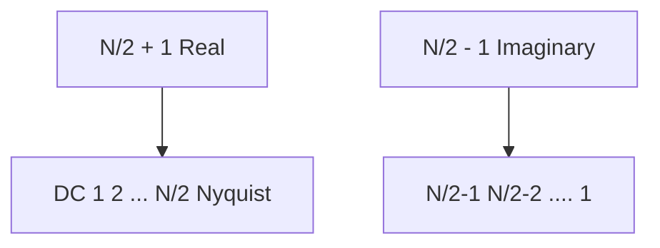

# Details

## Order of Operations

  1. Use the database_tools for downloading and sofa files and formatting the hdf5 files
  
Tornike: this is not done yet

    ```bash
    $ ./get_database.py <URL> <DIR-TO-SAVE> #Download the sofa files
    $ ./<name>_to_hdf5.py #Converts the sofa files with the appropriate information
    ```

  2. Run any preprocessing that is needed on the datasets. The delete_samples.py in preprocessing to only keep the first 64 samples. This will save a new dataset in the hdf5 file for the specified database under trunc_64. This will force overwrite the trunc_64 dataset in the hdf5 file.

    ```bash
    python delete_samples.py -t trunc_64 -n 64 cipic all -f
	```

  3. In networks, main-network.py will train the network on the data. This will train the network on cipic 003 subject trunc_64 dataset and then predict using the network.

    ```bash
    python main-network.py cipic 003 -t trunc_64 -a train predict
    ```
    
## Examples

  * An exmple of a plot command to plot the trunc_64 for left and right ear and put the output in file <file-name> would be

    ```bash
    python plot_hdf5.py -t trunc_64 <database>  <user>  -fn <file-name> -e l r -n 64
    ```

## FFT's 

### Numpy 

  * RFFT's produce $`\frac{n}{2} + 1`$ output points (upto and including nyquist)
  * Normalizing by dividing by the `min(nfft, data_length)` for a rectangular window

### Meyer FFT 


Tronike: not sure if this is done???? 

TODO: Shahrokh, fill this in with the Meyer_FFT details


Real Meyer FFT (an iFFT) routines returns (and expects) frequency domain information as
$`\frac{N}{2} +1`$ reals and $`\frac{N}{2} - 1`$ imaginaries with the following order:


