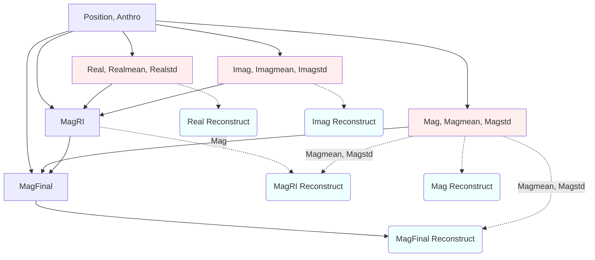

# Neural Networks

File structure

	main-network.py 
        initializer.py: read arguments and setups up defaults
        utilities/parameters.py: holds
                - the informatiom about the different databases
                - training orders
                - training parameters
    network_classes
        different networks combined in main-network
    utilities
        different utilities used in the network creating and training

## Network Structure

## Data Formatting
  * The data is stratified by utilities/network_data.py into the following categories and percentages
    * 10% Test Data
    * 72% training data
    * 18% validatiaon data (20% of 90%)

  * All random stratifications are seeded
    * Test data is stratified with "0"
    * and training and validation with "iteration+100"
